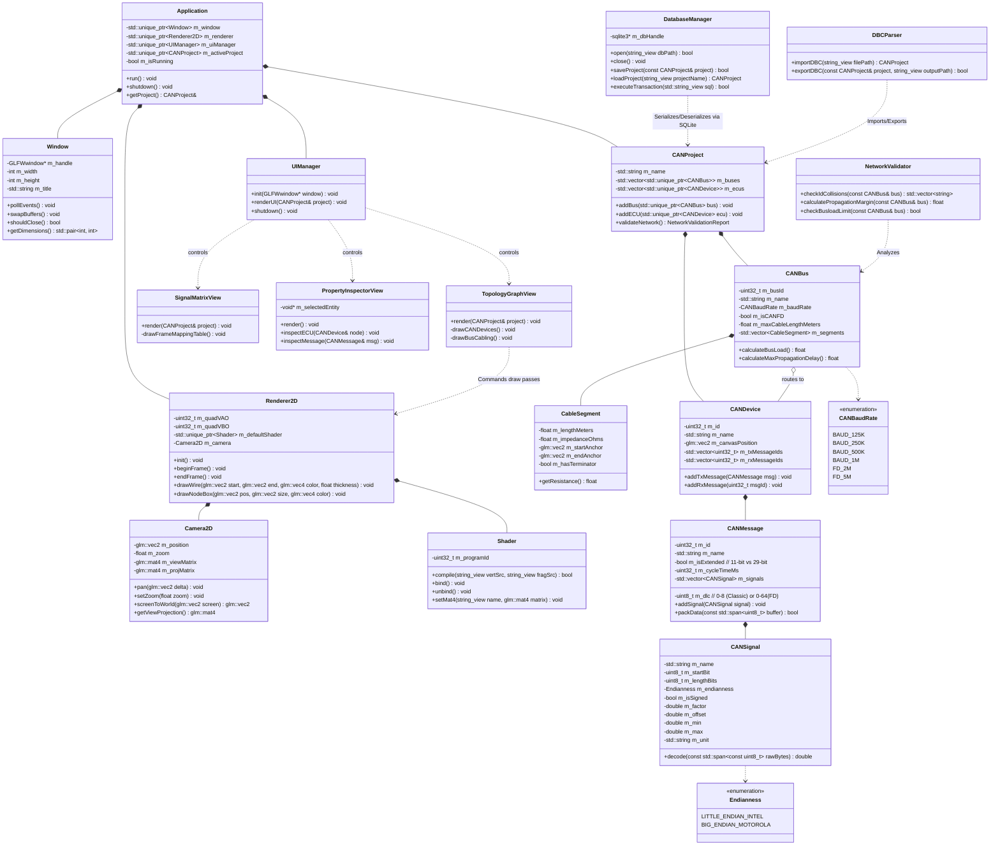

# UML Class Diagram

```mermaid
classDiagram
    %% Core & Platform Layer
    class Application {
        -std::unique_ptr~Window~ m_window
        -std::unique_ptr~Renderer2D~ m_renderer
        -std::unique_ptr~UIManager~ m_uiManager
        -std::unique_ptr~CANProject~ m_activeProject
        -bool m_isRunning
        +run() void
        +shutdown() void
        +getProject() CANProject&
    }

    class Window {
        -GLFWwindow* m_handle
        -int m_width
        -int m_height
        -std::string m_title
        +pollEvents() void
        +swapBuffers() void
        +shouldClose() bool
        +getDimensions() std::pair~int, int~
    }

    class Camera2D {
        -glm::vec2 m_position
        -float m_zoom
        -glm::mat4 m_viewMatrix
        -glm::mat4 m_projMatrix
        +pan(glm::vec2 delta) void
        +setZoom(float zoom) void
        +screenToWorld(glm::vec2 screen) glm::vec2
        +getViewProjection() glm::mat4
    }

    %% Rendering Layer (OpenGL 3.3 Core)
    class Renderer2D {
        -uint32_t m_quadVAO
        -uint32_t m_quadVBO
        -std::unique_ptr~Shader~ m_defaultShader
        -Camera2D m_camera
        +init() void
        +beginFrame() void
        +endFrame() void
        +drawWire(glm::vec2 start, glm::vec2 end, glm::vec4 color, float thickness) void
        +drawNodeBox(glm::vec2 pos, glm::vec2 size, glm::vec4 color) void
    }

    class Shader {
        -uint32_t m_programId
        +compile(string_view vertSrc, string_view fragSrc) bool
        +bind() void
        +unbind() void
        +setMat4(string_view name, glm::mat4 matrix) void
    }

    %% UI Layer (Dear ImGui)
    class UIManager {
        +init(GLFWwindow* window) void
        +renderUI(CANProject& project) void
        +shutdown() void
    }

    class TopologyGraphView {
        +render(CANProject& project) void
        -drawCANDevices() void
        -drawBusCabling() void
    }

    class SignalMatrixView {
        +render(CANProject& project) void
        -drawFrameMappingTable() void
    }

    class PropertyInspectorView {
        -void* m_selectedEntity
        +render() void
        +inspectECU(CANDevice& node) void
        +inspectMessage(CANMessage& msg) void
    }

    %% CAN Domain Layer
    class CANProject {
        -std::string m_name
        -std::vector~std::unique_ptr~CANBus~~ m_buses
        -std::vector~std::unique_ptr~CANDevice~~ m_ecus
        +addBus(std::unique_ptr~CANBus~ bus) void
        +addECU(std::unique_ptr~CANDevice~ ecu) void
        +validateNetwork() NetworkValidationReport
    }

    class CANBus {
        -uint32_t m_busId
        -std::string m_name
        -CANBaudRate m_baudRate
        -bool m_isCANFD
        -float m_maxCableLengthMeters
        -std::vector~CableSegment~ m_segments
        +calculateBusLoad() float
        +calculateMaxPropagationDelay() float
    }

    class CableSegment {
        -float m_lengthMeters
        -float m_impedanceOhms
        -glm::vec2 m_startAnchor
        -glm::vec2 m_endAnchor
        -bool m_hasTerminator
        +getResistance() float
    }

    class CANDevice {
        -uint32_t m_id
        -std::string m_name
        -glm::vec2 m_canvasPosition
        -std::vector~uint32_t~ m_txMessageIds
        -std::vector~uint32_t~ m_rxMessageIds
        +addTxMessage(CANMessage msg) void
        +addRxMessage(uint32_t msgId) void
    }

    class CANMessage {
        -uint32_t m_id
        -std::string m_name
        -bool m_isExtended // 11-bit vs 29-bit
        -uint8_t m_dlc // 0-8 (Classic) or 0-64 (FD)
        -uint32_t m_cycleTimeMs
        -std::vector~CANSignal~ m_signals
        +addSignal(CANSignal signal) void
        +packData(const std::span~uint8_t~ buffer) bool
    }

    class CANSignal {
        -std::string m_name
        -uint8_t m_startBit
        -uint8_t m_lengthBits
        -Endianness m_endianness
        -bool m_isSigned
        -double m_factor
        -double m_offset
        -double m_min
        -double m_max
        -std::string m_unit
        +decode(const std::span~const uint8_t~ rawBytes) double
    }

    %% Services, Persistence & Analysis
    class DatabaseManager {
        -sqlite3* m_dbHandle
        +open(string_view dbPath) bool
        +close() void
        +saveProject(const CANProject& project) bool
        +loadProject(string_view projectName) CANProject
        +executeTransaction(std::string_view sql) bool
    }

    class DBCParser {
        +importDBC(string_view filePath) CANProject
        +exportDBC(const CANProject& project, string_view outputPath) bool
    }

    class NetworkValidator {
        +checkIdCollisions(const CANBus& bus) std::vector~string~
        +calculatePropagationMargin(const CANBus& bus) float
        +checkBusloadLimit(const CANBus& bus) bool
    }

    %% Enums
    class Endianness {
        <<enumeration>>
        LITTLE_ENDIAN_INTEL
        BIG_ENDIAN_MOTOROLA
    }

    class CANBaudRate {
        <<enumeration>>
        BAUD_125K
        BAUD_250K
        BAUD_500K
        BAUD_1M
        FD_2M
        FD_5M
    }

    %% Relationships
    Application *-- Window
    Application *-- Renderer2D
    Application *-- UIManager
    Application *-- CANProject

    Renderer2D *-- Shader
    Renderer2D *-- Camera2D

    UIManager ..> TopologyGraphView : controls
    UIManager ..> SignalMatrixView : controls
    UIManager ..> PropertyInspectorView : controls

    CANProject *-- CANBus
    CANProject *-- CANDevice

    CANBus *-- CableSegment
    CANBus o-- CANDevice : routes to
    CANBus ..> CANBaudRate

    CANDevice *-- CANMessage
    CANMessage *-- CANSignal
    CANSignal ..> Endianness

    DatabaseManager ..> CANProject : Serializes/Deserializes via SQLite
    DBCParser ..> CANProject : Imports/Exports
    NetworkValidator ..> CANBus : Analyzes
    TopologyGraphView ..> Renderer2D : Commands draw passes
```